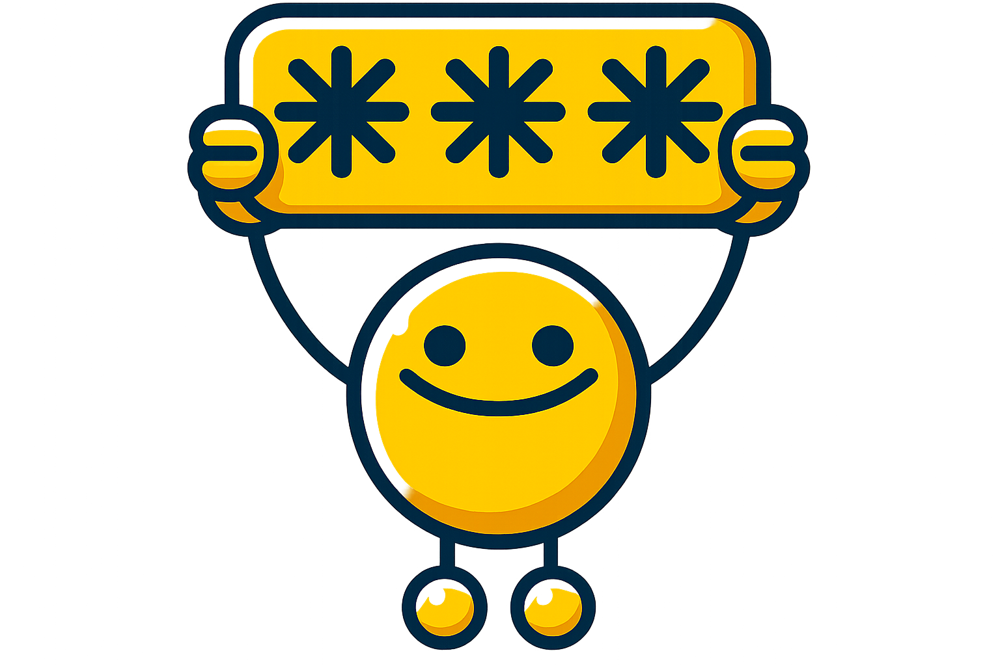

# Halt! What's the Passphrase? Web

## Happy Cybersecurity Awareness Month!

**Halt! What's the Passphrase? Web** is a browser-based passphrase generator that creates strong, memorable passphrases of exactly the length you choose (10 – 50 characters). It uses the Web Crypto API for true randomness, and lets you sprinkle in numbers or special characters. HWTP is not the usual smash‑lots‑of‑random‑words‑together-and-call-it-a-passphrase passphrase generator!

HWTP Web is based on [Halt! What's the Passphrase Python CLI on GitHub.](https://github.com/Unic0rn0ver10ad/halt-whats-the-passphrase)

## Licensing HWTP
Halt! What's the Passphrase? (HWTP) is free and unencumbered software released into the public domain. You are free to copy, modify, publish, use, compile, sell, or distribute this software, either in source code form or as a compiled binary, for any purpose, commercial or non-commercial, and by any means. [Click here to read the Unlicense license for this app.](https://unlicense.org/)

## But What About The Wordlist?
- The English wordlist used in HWTP is derived from [The EFF long word list](https://www.eff.org/files/2016/07/18/eff_large_wordlist.txt) which is licensed under the [Creative Commons Attribution 4.0 International License (CC-BY)](https://www.eff.org/copyright).
